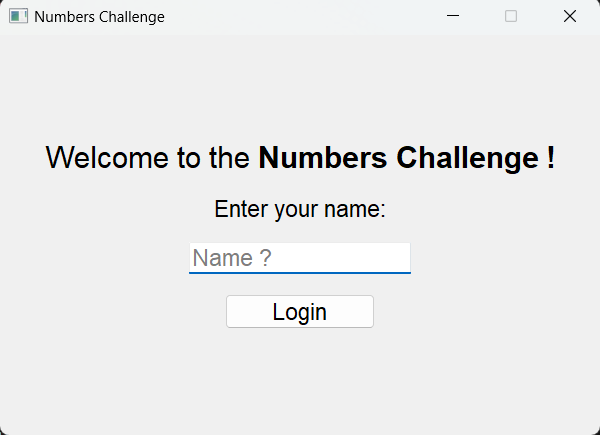
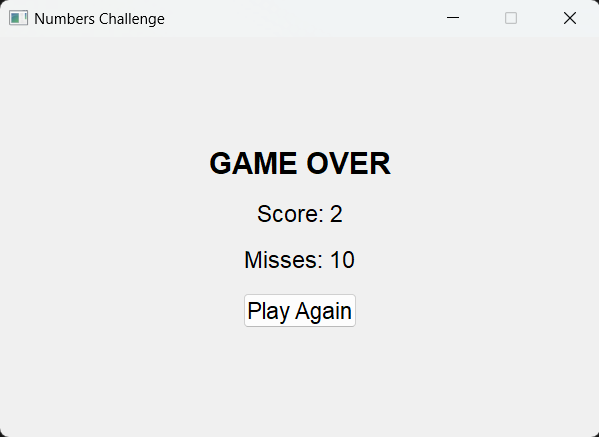
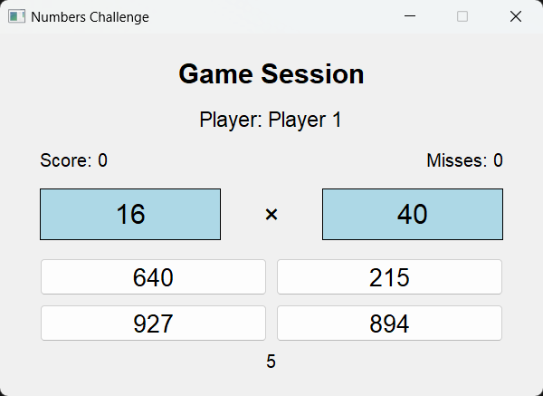
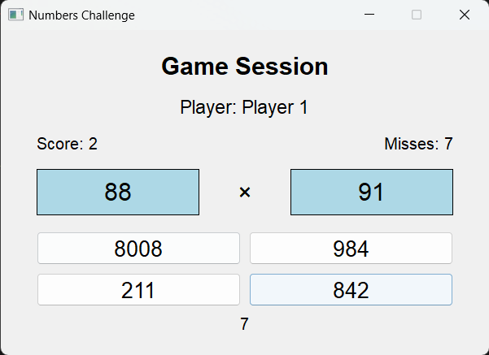
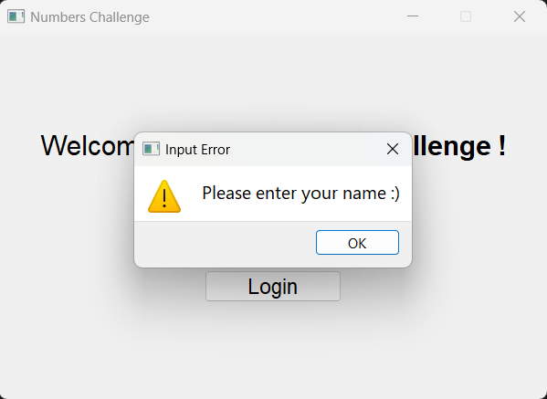

# Numers Challenge (Math Game)

## Overview

**Numbers Challenge** is a simple, interactive math game built with Python and PyQt5. This game is designed to level up mathematical and quick response skills for people of all ages. The game involves basic arithmetic problems where the player needs to identify the correct answers from multiple choices. The game tracks the player's score and the number of misses. When the player reaches 10 misses, the game ends and displays the final score and miss count.

## Features
- User login to start the game
- Randomly generated math problems
- Timer for each question
- Score and miss tracking
- Game over screen with the final score and miss count
- Option to play again after the game ends

## How to Play
1. **Start the Game** : Enter your name and click "Login" to start the game.

2. **Answer Questions** : Solve the math problems by clicking the correct answer button. The timer for each question is set to 10 seconds.

3. **Track Your Score** : Your score and misses are displayed on the screen. The game ends when you reach 10 misses.

4. **Game Over** : When the game ends, the final score and miss count are displayed along with a "Play Again" button to restart the game.

## Screenshots

Login & Game Over

Game Session

 Name Validation

## Contributing
If you would like to contribute to this project, please fork the repository and create a pull request with your changes.

This game currently focuses on multiplication, but I have plans to add more modes, including addition, subtraction, and other mathematical areas. Contributions towards these new features or improvements to the existing game are welcome.
